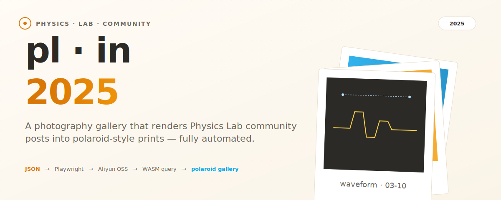
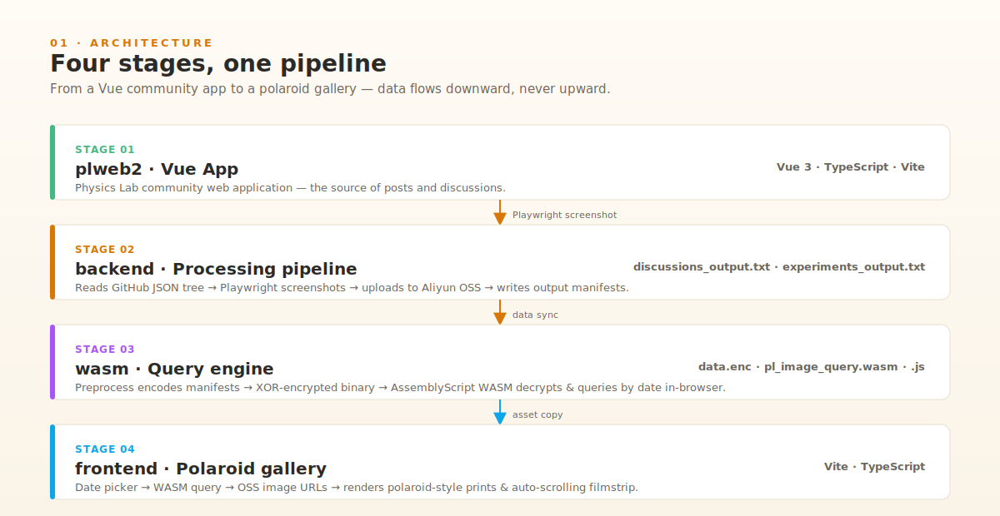
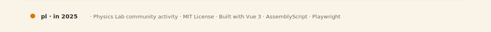

<p align="right">
  <strong>English</strong> · <a href="#中文">简体中文</a>
</p>

<p align="center">
  
</p>

<p align="center">
  <a href="https://github.com/wsxiaolin/pl-in-2025/blob/master/LICENSE"></a>
  
  
  
  
  
</p>

---

**pl · in 2025** is an activity for the [Physics Lab](https://turtlesim.com/products/physics-lab/index-cn.html) community. It is an automated photography-gallery pipeline that renders JSON-format post snapshots into images and displays them in a polaroid style.

The repository is a monorepo with four packages that work as a single pipeline: a Vue community app feeds a Playwright screenshot backend, which feeds an in-browser WASM query engine, which finally feeds a polaroid-style gallery frontend. Every stage produces a concrete artifact — there is no "TODO" or "coming soon" in the chain.

<p align="center">
  
</p>

## Why this exists

The Physics Lab community has been collecting posts, discussions, and experiments for years. Most of that content lives in JSON snapshots that are easy to query but hard to *see*. **pl · in 2025** turns those snapshots into something you can actually browse — a date-driven gallery of polaroid prints, generated entirely from the source data, with no manual curation step.

The design constraints are deliberate:

- **No server-side query at runtime.** All date lookups happen in the browser through a WASM module, so the gallery can be hosted on any static CDN.
- **No plaintext manifests on the wire.** Output manifests are XOR-encrypted into a single binary blob before shipping, which keeps the dataset non-trivially scrapable while still being fully client-side.
- **No manual image production.** Screenshots are taken by Playwright in CI, uploaded to Aliyun OSS, and referenced by URL — humans never touch the rendering step.

## What's inside

<p align="center">
  
</p>

| Directory   | Role in the pipeline                                                        | Tech stack                                  |
| ----------- | --------------------------------------------------------------------------- | ------------------------------------------- |
| `plweb2/`   | Source of community posts — the Vue app being screenshotted                 | Vue 3 · TypeScript · Vite                   |
| `backend/`  | Reads GitHub JSON tree, takes Playwright screenshots, uploads to Aliyun OSS | Playwright · Node · Aliyun OSS SDK          |
| `wasm/`     | Encodes manifests into XOR-encrypted binary; queries by date in-browser     | AssemblyScript · WASM                       |
| `frontend/` | Gallery page: date picker → WASM query → OSS image URLs → polaroid render   | Vite · TypeScript                           |

Each directory is independently buildable. The root `package.json` orchestrates them through a single `pipeline` script (see below).

## Get started

<p align="center">
  
</p>

### Prerequisites

- **Node.js 22+** — required by every package. Use [nvm](https://github.com/nvm-sh/nvm) and run `nvm install 22` if you need to switch.
- **Aliyun OSS credentials** — only required if you want to run the `backend` upload step. The frontend and WASM packages run without them.

### Install

```bash
git clone https://github.com/wsxiaolin/pl-in-2025.git
cd pl-in-2025
npm install
```

### Run the full pipeline

The root `package.json` exposes a single `pipeline` script that chains every stage in order:

```bash
npm run pipeline
```

Under the hood this runs:

```json
{
  "scripts": {
    "test": "echo \"Error: no test specified\" && exit 1",
    "frontend:dev": "npm run dev --prefix frontend",
    "frontend:build": "npm run build --prefix frontend",
    "wasm:build": "npm run build --prefix wasm",
    "wasm:test": "npm run test --prefix wasm",
    "backend:start": "npm run start --prefix backend",
    "sync:data": "node scripts/sync-data.mjs",
    "pipeline": "npm run sync:data && npm run wasm:build && npm run frontend:build"
  }
}
```

### Run a single stage

| You want to…                     | Command                          |
| -------------------------------- | -------------------------------- |
| Develop the gallery frontend     | `npm run frontend:dev`           |
| Build the WASM query module      | `npm run wasm:build`             |
| Test the WASM query module       | `npm run wasm:test`              |
| Run the backend screenshot job   | `npm run backend:start`          |
| Sync manifests from upstream     | `npm run sync:data`              |

## How the data flows

1. **`plweb2`** is the live Vue app. The backend treats it as the source of truth — it never reads posts from anywhere else.
2. **`backend`** walks the GitHub JSON tree of community posts, opens each post in Playwright, screenshots it, uploads the PNG to Aliyun OSS, and writes two manifest files: `discussions_output.txt` and `experiments_output.txt`.
3. **`wasm`** preprocesses those manifests into a single XOR-encrypted binary (`data.enc`) and ships an AssemblyScript module (`pl_image_query.wasm` + `pl_image_query.js`) that decrypts and queries by date entirely in the browser.
4. **`frontend`** is a Vite + TypeScript gallery page. The user picks a date, the WASM module returns the matching OSS image URLs, and the page renders them as polaroid prints with an auto-scrolling filmstrip.

## License

[MIT](./LICENSE) — see the `LICENSE` file for details.

---

<a id="中文"></a>

<p align="center">
  
</p>

## 这是什么

**pl · in 2025** 是物理实验室社区的一个活动，是一个自动化的摄影画廊处理项目，用于处理 JSON 格式的帖子快照。该仓库还包含后端脚本和 CI 流水线，用于渲染并上传图片至阿里云 OSS；一个 WASM 模块，用于在浏览器端按日期查询图片；以及一个前端画廊页面，以拍立得风格展示图片。

整个仓库是一个 monorepo，包含四个包，组成一条完整的流水线：Vue 社区应用 → Playwright 截图后端 → 浏览器端 WASM 查询引擎 → 拍立得风格画廊前端。每个阶段都会产出具体的产物，链条中不存在 "TODO" 或 "敬请期待"。

## 为什么需要它

物理实验室社区多年来积累了大量帖子、讨论和实验记录。这些内容大多以 JSON 快照的形式存在，便于查询却不便于"看见"。**pl · in 2025** 把这些快照变成真正可浏览的东西——一个按日期驱动的拍立得画廊，完全由源数据生成，无需任何人工整理。

设计上的几个约束是有意为之：

- **运行时无服务端查询。** 所有日期查询都通过 WASM 模块在浏览器内完成，画廊可以托管在任意静态 CDN 上。
- **传输中无明文清单。** 输出清单在发布前会被 XOR 加密为单一二进制文件（`data.enc`），既保留了完全客户端查询的能力，又让数据集不至于被轻易爬取。
- **无人工图片生产。** 截图由 Playwright 在 CI 中完成，上传至阿里云 OSS 后通过 URL 引用——人类从不介入渲染环节。

## 仓库目录

| 目录        | 在流水线中的角色                                          | 技术栈                                      |
| ----------- | --------------------------------------------------------- | ------------------------------------------- |
| `plweb2/`   | 社区帖子来源——被截图的 Vue 应用                           | Vue 3 · TypeScript · Vite                   |
| `backend/`  | 读取 GitHub JSON tree，Playwright 截图，上传至阿里云 OSS  | Playwright · Node · Aliyun OSS SDK          |
| `wasm/`     | 将清单编码为 XOR 加密二进制；浏览器端按日期查询           | AssemblyScript · WASM                       |
| `frontend/` | 画廊页面：日期选择 → WASM 查询 → OSS 图片 URL → 拍立得渲染 | Vite · TypeScript                           |

每个目录都可以独立构建。根 `package.json` 通过单一的 `pipeline` 脚本串联它们（见下文）。

## 快速开始

### 前置条件

- **Node.js 22+** —— 所有包都需要。如果需要切换版本，推荐使用 [nvm](https://github.com/nvm-sh/nvm) 并运行 `nvm install 22`。
- **阿里云 OSS 凭证** —— 仅在运行 `backend` 上传步骤时需要。frontend 和 wasm 包无需凭证即可运行。

### 安装

```bash
git clone https://github.com/wsxiaolin/pl-in-2025.git
cd pl-in-2025
npm install
```

### 运行完整流水线

根 `package.json` 暴露了一个 `pipeline` 脚本，按顺序串联所有阶段：

```bash
npm run pipeline
```

它内部执行：

```json
{
  "scripts": {
    "test": "echo \"Error: no test specified\" && exit 1",
    "frontend:dev": "npm run dev --prefix frontend",
    "frontend:build": "npm run build --prefix frontend",
    "wasm:build": "npm run build --prefix wasm",
    "wasm:test": "npm run test --prefix wasm",
    "backend:start": "npm run start --prefix backend",
    "sync:data": "node scripts/sync-data.mjs",
    "pipeline": "npm run sync:data && npm run wasm:build && npm run frontend:build"
  }
}
```

### 单独运行某个阶段

| 你想要…                          | 命令                              |
| -------------------------------- | --------------------------------- |
| 开发画廊前端                     | `npm run frontend:dev`            |
| 构建 WASM 查询模块               | `npm run wasm:build`              |
| 测试 WASM 查询模块               | `npm run wasm:test`               |
| 运行后端截图任务                 | `npm run backend:start`           |
| 从上游同步清单                   | `npm run sync:data`               |

## 数据如何流动

1. **`plweb2`** 是在线 Vue 应用。后端把它作为唯一数据源——从不从其他地方读取帖子。
2. **`backend`** 遍历社区帖子的 GitHub JSON tree，用 Playwright 打开每个帖子、截图、上传 PNG 至阿里云 OSS，并写入两个清单文件：`discussions_output.txt` 和 `experiments_output.txt`。
3. **`wasm`** 把这些清单预处理为单一 XOR 加密二进制（`data.enc`），并发布一个 AssemblyScript 模块（`pl_image_query.wasm` + `pl_image_query.js`），在浏览器内解密并按日期查询。
4. **`frontend`** 是 Vite + TypeScript 画廊页面。用户选择日期，WASM 模块返回匹配的 OSS 图片 URL，页面以拍立得风格渲染，并附带自动滚动的胶片条。

## 许可证

[MIT](./LICENSE) —— 详情见 `LICENSE` 文件。

<p align="center">
  
</p>
